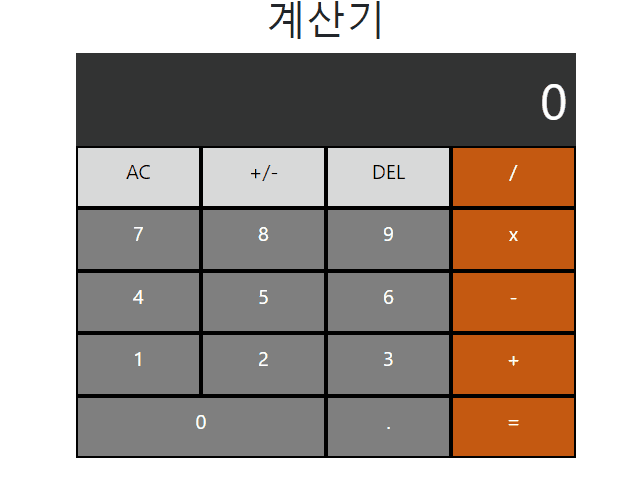

# 개발 과제 1주차

- **과제명?** 계산기 개발
- **기반 기술?** Vue.js + HTML + JavaScript

 

### 🍰 둘러보기

1. vscode 설치
2. node.js 설치
3. npm install vue
4. npm install -g @vue/cli
5. npm install vue-loader vue-template-compiler -D
6. npm run serve